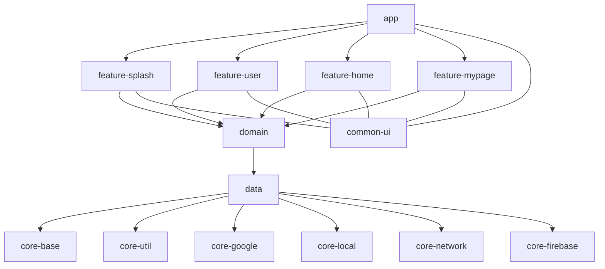
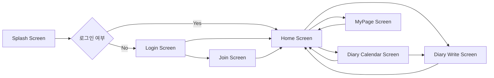
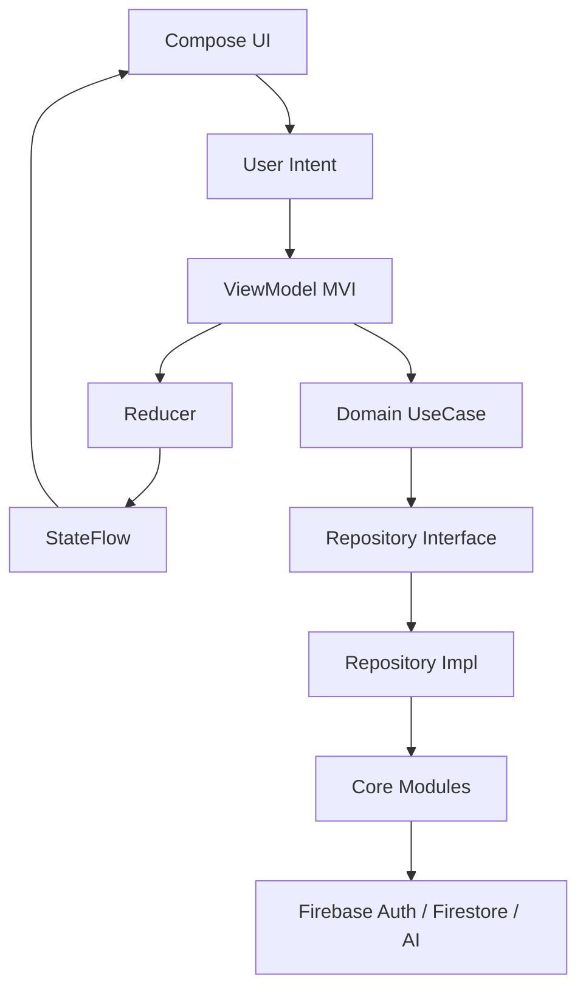
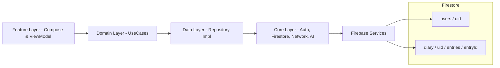
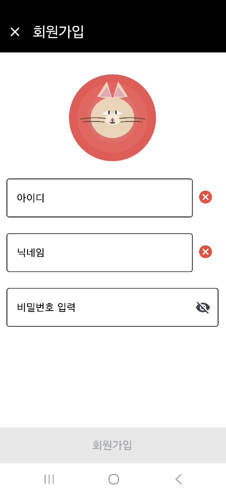
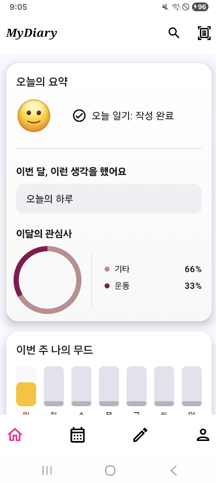
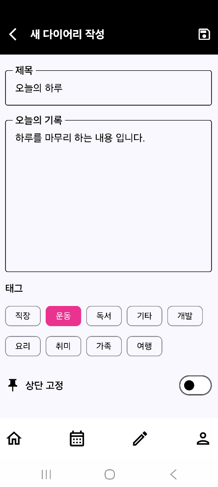
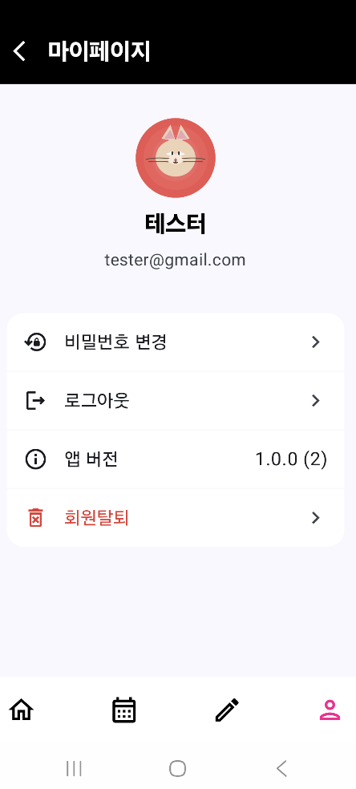

## 🧱 Architecture Overview

아래 다이어그램들은 Modern Diary App의 전체 구조, 화면 흐름, 아키텍처 패턴,  
그리고 Firebase 기반 데이터 흐름을 시각적으로 표현합니다.  
프로젝트를 이해하는 데 가장 핵심적인 4개의 구조도입니다.

---

### 📌 1) Multi-Module Architecture


### 📌 2) Feature Flow (화면 간 주요 흐름)


### 📌 3) MVI Architecture Flow

### 📌 4) Data Flow (Repository → Firebase)

---

## 📦 Multi-Module Structure

```pgsql
my-diary-app
├── app
│
├── feature
│   ├── feature-splash
│   ├── feature-user
│   ├── feature-home
│   └── feature-mypage
│
├── domain
│   ├── repository
│   ├── usecase
│   └── model
│
├── data
│   ├── repository-impl
│   └── datasource
│
├── core
│   ├── core-base
│   ├── core-util
│   ├── core-google
│   ├── core-local
│   ├── core-network
│   └── core-firebase
│
└── common-ui
```

## 🔗 Layer Flow

```kotlin
app → feature → domain → data → core → Firebase
```

## 🔄 MVI Flow

```scss
Intent → ViewModel → Reducer → StateFlow → Compose UI(Recompose)
```

## 🔥 Firestore Data Model

```bash
users/{uid}
diary/{uid}/entries/{entryId}
```

## ✨ 주요 기능 (Features)

**✔ 1) Firebase 인증 (Email + Google Login)**
- Firebase Auth 기반 회원가입/로그인
- Google Login을 core-google 모듈로 분리
- 로그인 시 Firestore Transaction 기반 사용자 정보 생성/업데이트
<br><br/>

**✔ 2) 다이어리 CRUD**
- 감정 점수(1~5) 선택 후 작성
- 키워드 기반 정리
- 날짜 별 문서 저장
- Firestore 자동 정렬
<br><br/>

**✔ 3) 홈(Home) – 무드 차트 UI**
- 최근 7일 Mood Score 차트
- 감정 점수에 따른 색상 변화
- 감정 요약 텍스트 표시
<br><br/>

**✔ 4) 마이페이지 (MyPage)**
- 사용자 정보 조회
- 로그아웃 및 계정 삭제
<br><br/>

**✔ 5) AI 추천 문장 생성 (Firebase AI Logic + Gemini)**
- 사용자의 감정 점수 + 키워드를 기반으로 오늘의 추천 영감(Reflection) 문구를 생성해 주는 기능입니다.

**AI Processing Flow**
```bash
User Input (mood + keyword)
       ▼
GenerateAiDiaryTextUseCase
       ▼
AiRepository
       ▼
Firebase AI Logic (Gemini)
       ▼
AI Response
       ▼
Compose UI 렌더링 → “이 문장으로 작성하기”
```
---

## 🧠 기술 선택 이유 (Technical Decisions)
본 프로젝트는 기술 트렌드를 따라가기보다
“왜 이 구조가 필요한가?”라는 질문에서 출발합니다.

**🔸 Compose**
- UI 변화가 잦고 재사용성이 필요한 Diary UI에 적합
- MVI와 자연스럽게 연결됨

**🔸 MVI**
- 일관된 상태관리, 예측 가능한 UI, 테스트 용이성 확보

**🔸 Clean Architecture**
- 기능 확장 및 Firebase → 서버 전환 시에도 영향 최소화

**🔸 Multi-Module**
- 실무처럼 구조화하여 유지보수성과 의존성 관리 능력 강화

**🔸 Firebase**
- 초기 서버 구성 없이도 실시간 데이터 실험 가능
- AI Logic이 Firebase와 자연스럽게 연동됨
<br><br/>

## 📸 스크린샷 (Screenshots)
<p align="left">
  
  
</p>

<br><br/>

<p align="left">
  
  
</p>

<br><br/>

<p align="left">
  
  
</p>

<br><br/>

<p align="left">
  
  
</p>

<br><br/>

<p align="left">
  
</p>

## 🏗 모듈 역할 상세 (Module Responsibilities)

**🔸 App**
- 네비게이션 그래프
- 전체 Feature 조립
- DI 추가

**🔸 feature**
- Compose UI
- ViewModel(MVI)
- Domain UseCase 호출

**🔸 domain**
- Repository 인터페이스 정의
- UseCase 정의/구현
- 비즈니스 모델

**🔸 data**
- Repository 구현체
- Firebase/Local 연동

**🔸 core**
- Firebase/Auth/Network/Local
- Google Login
- Base / Utilities

**🔸 common-ui**
- Compose 디자인 시스템
- 재사용성 높은 공통 UI 구성

## 🛠 설치 및 실행방법(Setup)

**1) Clone**

```bash
https://github.com/label94/simpleAOS.git
```

**2) Setting**
- Android gradle Plugin 8.13.1 이상
- Gradle 8.14.3-bin.zip 이상
- kotlin 2.2.21 이상
- JDK 17
- Android Studio Hedgehog 이상 권장


## 🔮 향후계획(Roadmap)
- 프로필 이미지 변경 기능 추가
- 검색 관련 기능 추가
- Media3 관련 샘플 코드 고도화
- 기타 UI 개선 건
- 신 기술 출시 시 샘플 코드 예제 추가

## 📚 학습 회고 (What I Learned)

이 프로젝트를 통해 다음을 깊이 이해했습니다:
- UI·상태를 완전히 분리한 MVI의 장점
- Compose 기반 UI 구조 설계 경험
- 모듈화를 통한 유지보수성 향상
- Firebase 인증/DB/AI Logic 적용 경험
- 기타 이슈 수정
- 협업 없이도 스스로 아키텍처를 설계·검증하는 경험

이 프로젝트는 앞으로도 지속적으로 확장되며
**“Modern Android 아키텍처 실험실”** 로 남을 예정입니다.


